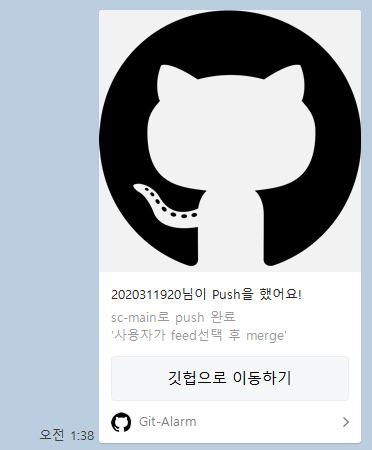
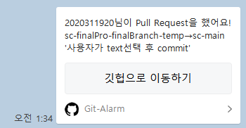
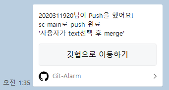

#  Kakao Alarm Bot</div>

<div align="center">
<p>




</p>
</div>

# 사전 설정

- [Kakao Developers](https://developers.kakao.com/)에 들어가 애플리케이션을 만든다.

- 


카카오 디벨로퍼
앱 만들기
팀원 넣기
rest api 코드를 사용자 입력 변수에 집어넣기


```yml
name: Example for show

on:
  push:
    branches:
      - main

jobs:
  run-hjk-test-v1:
    runs-on: ubuntu-latest
    
    steps:
    - name: Checkout code
      uses: actions/checkout@v2
      
    - name: Run hjk-test-v1 action
      uses: hyeonjeong-ko/packiging-test@5.7
      with:
        test-variable: "your test name"
        send-to-function: "send_to_me" or "send_to_friends"
        rest-api-key: "your rest api key" 
        redirect-uri: "your redirect url(이미지 또는 버튼을 클릭할 때 넘어갈 url)"
        code-key: "your Access Token"
        msg-template: "text" or "feed"
```

# 라이선스
이 프로젝트는 MIT 라이선스 하에 배포됩니다. 자세한 내용은 LICENSE 파일을 참고하세요.
